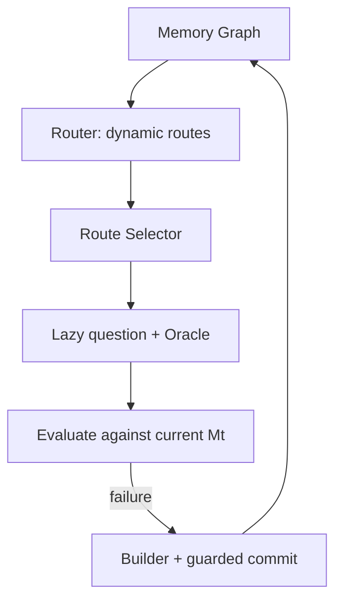

# Dynamic Graph Route Loop

## 1. 设计目标

训练始终从完整 Memory Graph 读取信息，不把有限 Probe 集合作为训练边界。

两个 learned policy 只有两个动作：

```text
Route Selector: 选择 candidate route 的 choice
Memory Builder: 生成一个 content 字符串
```

Question Generator、Oracle、Repair Controller 和 commit verifier 都是冻结环境。

## 2. 每轮流程



1. Router 从每个 case 的完整 Graph 提出 `routes_per_case` 条 Route；
2. 用 Route target 和当前 memory 构造 pairwise Selector records；
3. GRPO rollout 输出 choice 后，reward 环境才生成对应问题；
4. 合法问题按 Route 写入 `probe_cache.json`；
5. 训练后的 Selector 选择正式攻击 Route；
6. 当前 memory 已能回答则加入 `success_pool`；
7. 回答失败则由 Controller 决定 ADD/MERGE，Builder 只写 content；
8. 通过局部 reward 和 `success_pool` 全量回归后原子提交。

## 3. Router 与覆盖

Router 支持：

- `single_fact`：一个 active fact；
- `same_topic`：同一 topic 下的多个 active facts；
- `temporal_evolution`：archived → later active 状态变化；
- `comparison`：共享 cost/time/quantity/preference/location 等维度的 facts。

每轮第一条 Route 锚定 `node_visit_counts` 最小的 eligible evidence：既包括 active
single fact，也包括合法 archived→active temporal pair。其余 Route 仍按四种 mode
循环采样，并用逆访问次数加权。计数只在 Route 被正式选择尝试后写回 RunState，而
不是在它仅被提出时写回。

跨轮允许同一 Route 再次出现，因为 memory version 变化后 gap 也可能变化。同一轮
Router 内通过 route signature 去重。

## 4. Route Selector

Selector prompt 只包含：

```text
choice
relation / dimension
target facts
current known memories
route attack history
```

prompt 不包含 `probe_question`，因为问题尚未生成。Retriever 的 query 直接由 Route
target facts 拼接得到。

输出严格为：

```json
{"choice":0}
```

训练 pair 的构造：

- 同时有 covered/uncovered Route：循环较短一侧构造对比；
- 全 covered 或全 uncovered：按 novelty 排序，最低与最高配对。

## 5. 惰性 Probe Cache

Attacker rollout 选择 Route 后，reward 环境按以下顺序取得 Probe：

```python
probe = record.cached_probe
probe = probe or persistent_cache.get(route)
probe = probe or ProbeFactory.build(route)
```

`ProbeFactory.build` 最多尝试三次：

1. 冻结 DeepSeek 生成一个 Route-specific question；
2. 规则过滤多问题、元信息和内部 ID 泄漏；
3. Oracle 验证 objective answer、mode 和最小 supporting sources；
4. 检查 answer leak 和 route fidelity；
5. Qwen 用原始 sources 回答，Judge 要求正确率至少 0.8；
6. Qwen 无上下文回答，参数知识正确率达到 0.8 则拒绝。

Probe 构造失败不是 Route 的负样本：

```text
score = 0
reward_available = 0
```

成功 Probe 写入 process-safe `probe_cache.json`。Cache 只节省重复问题生成，不参与
Router 候选限制。

## 6. Attacker reward

合法 Probe 在当前 $M_t$ 上做 retrieval、answer 和 Judge：

$$
R_A=(1-C_t)+0.1N_t-0.1P_t
$$

- $C_t$：当前 memory answer correctness；
- $N_t$：Route 中未覆盖 evidence 的长度归一化 novelty；
- $P_t=1-1/\sqrt{1+n}$：Route 重复攻击惩罚。

Probe 按 Route 缓存，gap 按 `(route_id, memory_version)` 缓存。一个 GRPO group 的
多个 rollout 选择相同 Route 时只执行一次环境评估。

## 7. 冷启动

$M_0$ 为空时，大部分 Route 的 $1-C_t$ 都接近1，Attacker 的主要差异来自 novelty。
这不会触发跳过逻辑：

```text
Router 保证覆盖探索
Selector 正常 GRPO
Controller 大多返回 ADD
Builder 学习如何写入第一批 memory
```

随着 memory 增长，covered/uncovered 对比、answer correctness 和 repeat penalty 开始
产生更强梯度。

## 8. Builder 与 commit

Controller 用 Probe 的可信 node/source provenance 匹配 active memory：

```text
没有匹配 target → ADD
存在匹配 target → MERGE 全部匹配节点
```

Builder 只能输出：

```json
{"content":"..."}
```

rollout 临时状态不写可信 provenance。Builder reward：

$$
R_B=C_{after}-C_{before}-R_{regression}-0.05L
$$

正式 commit 在可信 provenance 状态上复验当前问题和整个 `success_pool`，全部通过
才替换 MemoryState。

## 9. 两个训练保障池

`success_pool`：

- 保存已正确回答且可归因到 memory support 的问题；
- 每次 commit 做全量回归；
- 防止新 ADD/MERGE 破坏旧能力。

`high_priority_buffer`：

- 保存 repair 失败或 Judge/API 不可用的问题；
- 下一轮最多占实际攻击预算的一半；
- 失败项重新入队尾，避免永久阻塞。

剩余预算至少尝试一条 Router coverage route，再由 Selector 补足。

## 10. 状态与恢复

`run_state.json`：

```text
pipeline_version = dynamic_graph_route_loop_v2
graph_version
next_round
attacker_model
builder_model
cases:
  memory
  node_visit_counts
```

`probe_cache.json` 单独持久化问题缓存。Graph version、case 集合或 pipeline version 不
一致时直接拒绝恢复，要求新的 work directory。

## 11. 主要文件

| 文件 | 职责 |
|---|---|
| `attacker/graph_router.py` | 动态 Route 与最少访问节点覆盖 |
| `attacker/selector.py` | Route-only observation、choice schema |
| `attacker/probe.py` | 选中 Route 的问题生成与过滤 |
| `attacker/probe_cache.py` | 惰性、进程安全 Probe cache |
| `attacker/reward.py` | choice → lazy Probe → gap reward |
| `defender/controller.py` | provenance 决定 ADD/MERGE |
| `defender/memory_builder.py` | content-only Builder |
| `training/dataset_builder.py` | 动态 Route pair 和 Verl dataset |
| `training/run_alternating.py` | Graph→Selector→Probe→Builder 主循环 |
| `training/run_state.py` | Memory 与 Graph 覆盖状态恢复 |

## 12. 运行

```bash
bash train.sh \
  --graph ./data/longmemeval/memory_graph_v4_10.json \
  --graph-version v4 \
  --model /root/autodl-tmp/models/Qwen3-1.7B \
  --work-dir ./data/training_10_v3.0 \
  --rounds 5 \
  --epochs 1
```
