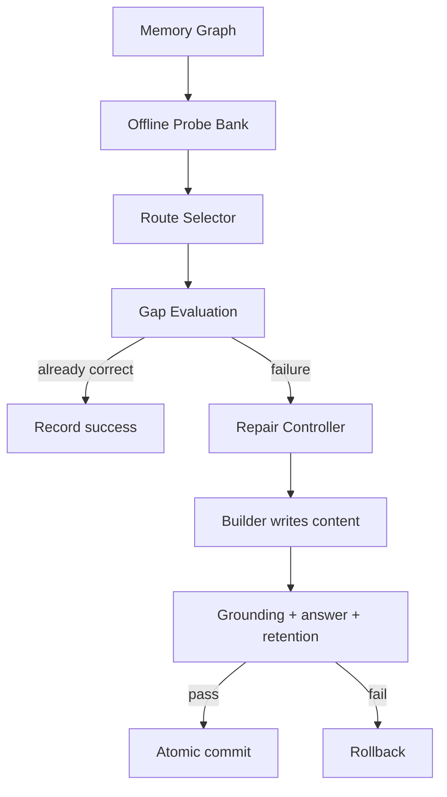

# 极简 Attacker / Memory Builder 代码说明

## 1. 设计目标

旧流程把三个不同问题混在训练循环里：寻找攻击位置、生成问题措辞、决定如何编辑
记忆。结果是 Attacker 容易学习措辞漏洞，Builder 同时承担 operation、target 和
content 三类决策，Judge 还要判断这些决策是否彼此一致。

新流程固定边界：

| 组件 | 唯一职责 | 是否学习 |
|---|---|---|
| Graph Router | 离线提出结构合法的证据 Route | 否 |
| Probe Factory | 离线生成并验证固定问题 | 否 |
| Route Selector | 从固定 Probe 中选择当前最有价值的缺口 | GRPO |
| Repair Controller | 按可信 provenance 决定 ADD/MERGE 和 target | 否 |
| Memory Builder | 只生成 memory content | GRPO |
| Reward / Commit | 验证 grounding、答案和回归 | 否 |

因此两个 policy 的 credit assignment 都只有一个变量：Selector 只负责“选哪里”，
Builder 只负责“写什么”。

## 2. 端到端数据流



训练期不调用 Graph Router、Probe Generator 或 Oracle。每轮只读取同一份 Bank，
因此 reward 的变化只来自当前 memory state 和 policy 的 route choice。

## 3. 离线 Probe Bank

### 数据结构

`attacker/probe_bank.py` 定义 `ProbeBank`：

```text
ProbeBank
  graph_version
  cases[case_index]
    RouteProbe
      route
      fixed question
      canonical answer
      supporting evidence
```

加载时要求 schema 为 `probe_bank_v1`，并要求每个 case 至少两个 Probe，保证
Route Selector 能构造对比 prompt。

### 构建逻辑

`scripts/build_probe_bank.py` 对每个 case 重复执行小批量 route sampling，直到：

- 收集到 `--probes-per-case` 个有效 Probe；或
- 达到 `--max-routes-per-case` 的离线预算。

Route 用 `route_signature` 去重。每完成一个 case 就写入输出文件，任务中断后可继续。
默认目标是 32 个有效 Probe/case，最大尝试 512 条 Route/case。这里把“16 条 Route
太少”的问题从在线训练中移到了可控、可复用的离线数据质量问题。

## 4. Route Selector

### 输入和输出

每个 prompt 对比两条固定 Probe，输入包含：

- Route 的证据 target 和 relation；
- 固定 `probe_question`；
- 当前检索到的 `known` memory；
- 该 Route 的历史攻击统计。

输出严格为：

```json
{"choice": 0}
```

### Reward

`attacker/reward.py` 不再给 storage/retrieval/reasoning 手工设置不同权重。三类 gap
仍由 `GapEvaluator` 计算并写入 trace，但只作分析。

实际 reward 为：

$$
R_A=(1-C_{before})+0.1N-0.1P
$$

其中：

- $C_{before}$：固定 Answer Agent 从当前 memory 回答的正确度；
- $N$：该 Probe 的未覆盖 evidence 数量除以存储 token 的平方根，并在当前候选间归一化；
- $P=1-1/\sqrt{1+n}$：Route 被重复攻击 $n$ 次后的惩罚。

冷启动时所有 Probe 都可能回答失败，但 $N$ 仍提供差异化信号；随着 memory 建立，
$C_{before}$ 会让 Selector 转向尚未解决的真实缺口。模型不生成 question，因此不能
通过故意模糊、泄漏答案或制造不可回答措辞来获得奖励。

## 5. Repair Controller

`defender/controller.py` 是纯确定性逻辑。它把 Probe 所需的 `node_id/source_id` 与
active memory 的可信 provenance 做交集：

| provenance 匹配 | operation | targets |
|---|---|---|
| 没有匹配 | ADD | 空 |
| 至少一个匹配 | MERGE | 所有匹配的 active memory |

这条规则同时覆盖冷启动和后续阶段：空 memory 自然全部是 ADD；部分证据已存在时
自然转成 MERGE。gap taxonomy 不参与动作选择，LLM 也不能伪造 target。

## 6. Memory Builder

### 输入和输出

`defender/models.py` 中的 `MemoryBuilderObservation` 只包含：

- 当前 question；
- `new_evidence`；
- Controller 已选定的 `operation`；
- MERGE 时的 `target_memories`。

Builder 输出严格为：

```json
{"content": "The user plans to visit Kyoto in October."}
```

`defender/memory_builder.py` 解析后，把 content 与 `RepairPlan` 合成内部
`MemoryEditAction`。模型不能输出 operation、target、ID 或额外字段。

### Reward

Grounding Judge 只回答一个布尔值 `valid`：新 content 必须被 evidence/targets
支持、覆盖新 evidence，并在 MERGE 时保留 targets 的事实与时间区别。`valid=false`
直接得到 `-1`。

通过 grounding 后：

$$
R_B=C_{after}-C_{before}-R_{regression}-0.05L
$$

其中 $L$ 是 content token 数相对 128-token 上限的比例。GRPO rollout 中的
regression 检查只覆盖被 target memory 关联的历史能力，以控制调用成本。

## 7. 两层验证与提交

训练 reward 与真实 commit 有意分成两层：

1. Rollout 验证：grounding、当前答案、target 相关能力、长度。
2. Commit 验证：在带可信 provenance 的临时状态上，重新验证当前问题以及
   capability ledger 中全部历史成功问题。

只有全部通过才把临时状态替换为正式 `MemoryState`。通过的能力进入
`success_pool`，作为之后每次 commit 的全量回归基线。任何失败都保留旧状态，并把
当前 capability 放入 `high_priority_buffer`，保证下一轮强制重放。

rollout 创建的临时 node 不写 provenance，避免 reward 因读取隐藏标签而虚高；
commit 时才继承 target provenance 并写入新 evidence provenance。

## 8. 极简训练循环

`training/run_alternating.py` 每轮固定执行五步：

1. 用整个固定 Bank 和当前 memory 构造 Route Selector 对比数据并训练。
2. 先从 `high_priority_buffer` 强制重放，最多占候选预算一半；Selector 再从
   `passed=false` 或未见过的 Probe 中补足剩余候选。
3. 已能回答的直接记为成功；回答失败的生成确定性 `RepairPlan`。
4. 用 pending repair 训练 Builder，再生成 content 并评分。
5. 通过全量回归后提交，保存 `run_state.json`。

删除的在线分支包括：

- 每轮 Route Proposal 和 Probe/Oracle 生成；
- 训练 pool 与 audit pool 两套采样；
- Builder 的 operation/target 学习；
- saturation、patience、per-case stop state；
- compaction policy/server/auditor。

训练严格执行请求的 `--rounds`。Bank 全部通过时该 case 不再产生 repair，但仍可
作为 Selector 的已解决负样本。

## 9. 状态与恢复

`training/run_state.py` 只保存：

- `next_round`；
- Attacker/Builder checkpoint；
- 每个 case 的 `MemoryState`。

Probe 不写入状态，因为 Bank 是只读真源。新状态标记为
`minimal_memory_loop_v1`。旧 checkpoint 的 Builder schema 不兼容，代码会拒绝
旧 `run_state.json` 并要求新 work directory，而不是进行不可靠的隐式迁移。

`MemoryState` 保留 node、capability ledger、evidence ledger、edit history、route
attack history，以及两项训练保障状态：

- `success_pool`：所有已验证能力，正式 commit 必须对其做全量回归；
- `high_priority_buffer`：失败或 Judge 暂不可用的能力，下一轮优先重放。

高优先级队列最多占每轮候选预算的一半；重放仍失败的项目移动到队尾，避免一个
长期失败项阻塞其他修复，同时保留 Attacker 探索新缺口的预算。

## 10. 主要文件

| 文件 | 作用 |
|---|---|
| `attacker/probe_bank.py` | 固定 Probe Bank 的 schema、读写和校验 |
| `scripts/build_probe_bank.py` | 离线采样 Route、验证 Probe、断点保存 |
| `attacker/gap.py` | 当前答案评估、诊断 gap、evidence novelty |
| `attacker/reward.py` | Selector 的 failure/novelty/repeat reward |
| `defender/controller.py` | provenance 驱动的 ADD/MERGE 与 target 选择 |
| `defender/models.py` | RepairPlan、Builder observation/reward context |
| `defender/memory_builder.py` | content-only prompt、严格解析、执行 |
| `defender/reward_judge.py` | 单布尔 grounding/coverage/preservation Judge |
| `defender/reward.py` | correctness gain、regression、length reward |
| `training/alternating.py` | 单 Probe 的 evaluate/repair/guarded commit |
| `training/run_alternating.py` | 五步固定交替训练循环 |
| `training/run_state.py` | 最小可恢复状态 |

## 11. 预期效果与边界

这次重构主要降低方差和 Judge 难度，不保证小模型一定找到最优 memory 表述。需要
重点观察：

- Bank 中每个 case 的有效 Probe 数和 attack mode 分布；
- Selector rollout 的 `informative_groups` 与 `unique_choices`；
- Builder 的 `format_valid`、`grounded`、`gain`、`regression`；
- commit 通过率与 active memory token 增长。

如果某类缺口长期缺失，优先扩充离线 Bank，而不是在 reward 中重新加入复杂的 gap
权重。如果 memory 膨胀，再把 compaction 作为独立离线任务实现，不应重新塞回
Builder 的 repair action space。
