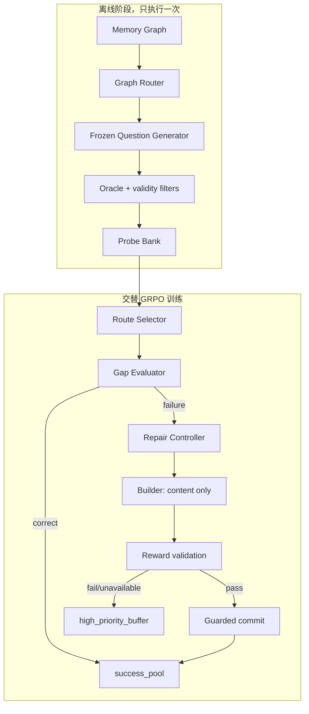
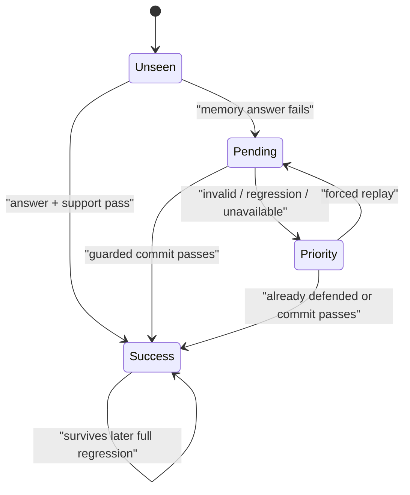

# AdvMem 代码与算法逻辑详解

本文对应分支 `codex/minimal-memory-loop-v1`，描述当前代码实际执行的算法，而不是
概念草图。目标是让读者能够回答以下问题：

1. Attacker 究竟学习什么，reward 从哪里来？
2. 冷启动为什么可以训练，为什么主要产生 ADD？
3. ADD/MERGE 和 target memory 由谁决定？
4. Memory Builder 为什么只输出 content？
5. `success_pool`、`high_priority_buffer` 如何保障训练？
6. 一个 repair 如何从 rollout 走到正式 commit？
7. 每轮到底构造多少数据、调用哪些模型、保存哪些状态？

---

## 1. 问题定义

对于每个 LongMemEval case，系统维护随训练变化的长期记忆状态：

$$
M_t=\{m_1,m_2,\ldots,m_k\}
$$

离线 Probe Bank 提供固定问题集合：

$$
\mathcal P=\{p_i=(r_i,q_i,a_i,E_i)\}
$$

其中：

- $r_i$：Memory Graph 上的一条证据 Route；
- $q_i$：冻结且经过 Oracle 验证的问题；
- $a_i$：canonical answer；
- $E_i$：回答问题所需的 supporting evidence。

系统交替训练两个策略：

- Route Selector（Attacker）$\pi_A$：从若干固定 Probe 中选择当前最可能暴露缺口的
  Probe；
- Memory Builder $\pi_B$：在 operation 和 target 已确定后，只生成新的 memory
  content。

核心约束是：问题生成不参与在线 RL，memory operation 不由 LLM 决定。这样两个
策略的 credit assignment 分别收敛为“选哪里”和“写什么”。

---

## 2. 全局架构



### 2.1 五个不可破坏的系统不变量

1. **Probe 固定**：训练期间不重新生成或改写问题。
2. **动作确定**：ADD/MERGE 和 target 只由可信 provenance 决定。
3. **Builder 单职责**：Builder 只能输出一个非空 `content` 字段。
4. **提交保守**：rollout 通过不等于正式提交；commit 必须复验全部成功能力。
5. **修复失败必重放**：进入正式 repair 后失败或服务不可用的能力进入高优先级队列。

---

## 3. 代码目录与调用关系

| 层 | 文件 | 核心职责 |
|---|---|---|
| 离线数据 | `scripts/build_probe_bank.py` | 反复采样 Route，构建并增量保存 Probe Bank |
| 离线数据 | `attacker/probe_bank.py` | Probe Bank schema、序列化、加载校验 |
| 路由 | `attacker/graph_router.py` | 按 attack mode 从图上采样证据 Route |
| Probe | `attacker/probe.py` | 固定问题生成、Oracle/泄漏/参数知识过滤 |
| Attacker | `attacker/selector.py` | 构造候选观察、严格解析 choice、执行选路 |
| Attacker | `attacker/gap.py` | 检索、回答、gap 诊断、novelty 计算 |
| Attacker | `attacker/reward.py` | Route Selector reward 与缓存 |
| Builder | `defender/controller.py` | 确定 ADD/MERGE 和 target IDs |
| Builder | `defender/models.py` | RepairPlan、observation、reward context |
| Builder | `defender/memory_builder.py` | content-only prompt、解析和临时执行 |
| Builder | `defender/reward_judge.py` | 单布尔 grounded/covered/preserved 判断 |
| Builder | `defender/reward.py` | Builder reward、当前答案和局部回归 |
| 状态 | `memory/models.py` | MemoryNode、CapabilityRecord、MemoryState |
| 状态 | `memory/store.py` | ADD/MERGE、success/high-priority 状态转换 |
| 流程 | `training/alternating.py` | 单 Probe 的评估、repair、全量回归、commit |
| 流程 | `training/run_alternating.py` | 一轮 Attacker→Builder 交替训练 |
| 数据 | `training/dataset_builder.py` | 对比样本和 Parquet 数据集生成 |
| 训练 | `training/verl_runner.py` | 启动 Verl、控制 batch、合并 FSDP checkpoint |
| 恢复 | `training/run_state.py` | checkpoint 与各 case MemoryState 的持久化 |

主调用链：

```text
train.sh
  → scripts/run_alternating.sh
    → training.run_alternating.run
      → RouteSelectorDatasetBuilder.records
      → VerlRunner.train(attacker)
      → RouteSelector.select_many
      → MemoryTrainingFlow.try_process_question
      → memory_builder_records
      → VerlRunner.train(memory_builder)
      → MemoryBuilderReward.evaluate
      → MemoryTrainingFlow.commit
      → RunState.save
```

---

## 4. 核心数据结构

### 4.1 RouteProbe：固定攻击单元

定义在 `attacker/models.py`：

| 字段 | 含义 |
|---|---|
| `question_id` | Route + question 的稳定哈希标识 |
| `route` | 图游走、证据节点、source records、attack mode |
| `oracle` | question、canonical answer、supporting evidence、validity |
| `golden_answer` | 冻结 Answer Agent 基于原始 sources 生成的答案 |

`RouteProbe` 一旦写入 Bank，训练期间保持不变。

### 4.2 MemoryNode：可检索记忆单元

| 字段 | 用途 |
|---|---|
| `id` | 由 version、operation、targets、content 哈希产生 |
| `content` | Builder 生成的自然语言记忆 |
| `status` | `active` 或 `archived` |
| `provenance_node_ids` | 对应原图 evidence node IDs |
| `source_ids` | 对应原始对话 source IDs |
| `linked_questions` | 当前由该 memory 支持的能力 question IDs |
| `time_span` | evidence 和 target memory 的时间范围 |
| `token_count` | 长度惩罚和统计使用 |
| `created_version/updated_version` | 状态版本审计 |

### 4.3 CapabilityRecord：问题级能力账本

它不保存模型参数，而是记录系统是否能用当前 memory 回答某个固定 Probe：

| 字段 | 用途 |
|---|---|
| `question_id/question` | 能力标识和问题文本 |
| `route_id/attack_mode` | 来源 Route |
| `oracle_answer` | 回归测试答案 |
| `supporting_memory_node_ids` | 最近一次验证出的支持 memory |
| `discovered_gap` | 最近发现的 gap 类型，仅诊断 |
| `passed` | 当前能力是否通过 |
| `verified_version` | 最近通过验证的 memory version |

### 4.4 MemoryState：一个 case 的完整训练状态

```text
MemoryState
  version                  # 每次 ADD/MERGE +1
  iteration                # 每轮训练 +1
  nodes                    # active + archived memories
  capability_ledger        # question_id → CapabilityRecord
  evidence_ledger          # question_id → trusted evidence
  edit_history             # 每次 memory edit 的审计记录
  success_pool             # 正式提交必须全量回归的能力
  high_priority_buffer     # 下一轮必须优先重放的失败能力
  attack_history           # Route 重复攻击与 gap 统计
```

这里不能删除 `success_pool` 或 `high_priority_buffer`。前者定义 commit 的安全边界，
后者保证暂时失败的能力不会被随机采样淹没。

### 4.5 RepairPlan：确定性编辑计划

```text
RepairPlan
  operation: add | merge
  target_node_ids: tuple[str, ...]
```

`RepairPlan` 来自 `RepairController`，不来自 Builder 输出。

---

## 5. 离线 Probe Bank

### 5.1 为什么必须离线固定

如果 Attacker 同时选择 target 并生成 question，reward 失败时无法判断是 target 真有
缺口，还是措辞刻意导致检索/回答失败。固定 question 后，Attacker action 只剩 route
choice，reward 变化可归因于攻击位置。

### 5.2 Bank schema

`attacker/probe_bank.py` 使用 `probe_bank_v1`：

```json
{
  "schema_version": "probe_bank_v1",
  "graph_version": "v4",
  "cases": {
    "0": ["RouteProbe", "RouteProbe"],
    "1": ["RouteProbe", "RouteProbe"]
  }
}
```

加载约束：

- schema 必须匹配；
- Bank 至少包含一个 case；
- 每个 case 至少两个 Probe，否则不能形成 route 对比。

### 5.3 离线构建算法

默认参数：

- 目标：32 个有效 Probe/case；
- 每批提出：16 条 Route；
- 最大预算：512 条 Route/case。

伪代码：

```python
for case in graph_cases:
    probes = load_existing_case_probes()
    signatures = {p.route.route_signature for p in probes}

    while len(probes) < target and proposed < max_routes:
        seed = base_seed + case * max_routes + batch_index
        routes = GraphRouter(seed).sample(routes_per_batch)
        routes = remove_seen_signatures(routes, signatures)
        signatures.update(route.route_signature for route in routes)
        probes.extend(ProbeFactory.build_many(routes))

    require(len(probes) >= 2)
    save_bank_after_this_case(probes[:target])
```

每完成一个 case 就保存一次，任务中断后可继续。已达到目标的 case 会直接跳过。

### 5.4 Graph Router 的四种离线 Route

Graph Router 是覆盖导向的启发式 proposal generator，不是在线 Attacker policy。它
优先采样访问次数较少的 evidence node，并用 route signature 去重：

| attack mode | Route 结构 | 成立条件 |
|---|---|---|
| `single_fact` | 一个 active fact | 图中存在 activated fact |
| `same_topic` | 同一 topic 下的 2–3 个 active facts | topic 至少连接两个 active facts |
| `temporal_evolution` | archived fact → `MERGED_TO` → later active fact | 新 fact 含状态变化语义，且 source time 更晚 |
| `comparison` | 同一 topic 下、共享比较维度的两个 active facts | 共同维度属于 cost/time/quantity/preference/location/physical attribute |

某种 mode 无可用 Route 时，允许回退到 `single_fact`。这些 mode 只影响离线 Bank 的
问题分布；在线 Route Selector 看到的是固定 Probe 候选，不会调用 Graph Router。

### 5.5 一个 Probe 的过滤链

`ProbeFactory.build` 最多尝试若干次问题生成，依次执行：

1. Frozen generator 根据 Route target 生成 question；
2. 检查问题长度、格式及 Route 约束；
3. Oracle 判断问题客观、无歧义且答案由 sources 支持；
4. 拒绝 question 中直接泄漏答案的样本；
5. `route_fidelity >= 0.8`，确保 Oracle evidence 与目标 Route 一致；
6. Answer Agent 从原始 sources 回答，不能返回 `INSUFFICIENT_INFORMATION`；
7. Answer Judge 要求 golden answer 正确度至少 0.8；
8. Answer Agent 无上下文回答；若参数知识正确度达到 0.8，则丢弃该 Probe；
9. 生成稳定 `question_id` 并写入 Bank。

因此 Bank 追求的是“由指定会话证据支持、不能仅靠参数知识回答”的诊断问题。

---

## 6. Memory 检索与 gap 诊断

### 6.1 `support_coverage`

对于 Probe 的 required node/source 集合与 memory provenance/source 集合，分别计算：

$$
c_{node}=\frac{|N_{required}\cap N_{memory}|}{|N_{required}|}
$$

$$
c_{source}=\frac{|S_{required}\cap S_{memory}|}{|S_{required}|}
$$

最终 coverage：

$$
c=\max(c_{node},c_{source})
$$

使用 max 是为了兼容有些图只可靠保留 node ID、有些数据只可靠保留 source ID。

### 6.2 GapEvaluator

输入固定 Probe 与当前 $M_t$：

```python
retrieved = retriever.retrieve(question, M_t, top_k=5)
structural = support_coverage(probe, M_t.active_nodes)
retrieved_cov = support_coverage(probe, retrieved)

if retrieved is empty:
    gap = STORAGE if structural < 1 else RETRIEVAL
    correctness = 0
else:
    answer = AnswerAgent(question, retrieved)
    correctness = AnswerJudge(answer, canonical_answer)
    if correctness >= 0.8:
        gap = NONE
    elif structural < 1:
        gap = STORAGE
    elif retrieved_cov < 1:
        gap = RETRIEVAL
    else:
        gap = REASONING
```

定义：

| gap | 判定 |
|---|---|
| `storage_gap` | required provenance 尚未完整进入 active memory |
| `retrieval_gap` | memory 中存在完整支持，但 top-k 未完整取回 |
| `reasoning_gap` | 支持已进入 top-k，Answer Agent 仍回答错误 |
| `none` | correctness ≥ 0.8 |

**重要**：gap 类型只用于诊断、日志和 capability 记录，不再映射成人工 reward 权重，
也不决定 ADD/MERGE。

---

## 7. Route Selector 训练数据

### 7.1 Novelty

首先找出 memory 尚未覆盖的 supporting evidence：

$$
E_i^{new}=\{e\in E_i:\ e.node\notin M_t\land e.source\notin M_t\}
$$

原始 novelty：

$$
\tilde N_i=\frac{|E_i^{new}|}{\sqrt{\max(1,\sum_{e\in E_i^{new}}tokens(e.quote))}}
$$

然后在该 case 的 Probe 集合内归一化：

$$
N_i=\begin{cases}
\tilde N_i/\max_j\tilde N_j,&\max_j\tilde N_j>0\\
0,&\text{otherwise}
\end{cases}
$$

它偏好“单位存储长度覆盖更多新 evidence”，但不会直接决定 action。

### 7.2 Pair 构造

将 Probe 按 structural coverage 分为：

- covered：coverage = 1；
- uncovered：coverage < 1。

若两组都存在，则循环较短一侧，构造 `max(C,U)` 个 covered-vs-uncovered pair。

若全部 covered 或全部 uncovered，则按 novelty 排序，将最低与最高、次低与次高配对，
共构造 $\lfloor P/2\rfloor$ 个 pair。

因此冷启动阶段不会跳过 Attacker。若每个 case 有 32 个 Probe，冷启动时约产生
16 个 selector prompt/case；10 个 case 约为 160 条记录，再进行 train/val 划分。

### 7.3 每条 Verl record

```text
data_source = route_selector
ability = memory_route_selection
prompt = [system, user]
ground_truth = hash(route_id_0 | route_id_1)
extra_info =
  memory_version
  memory_nodes snapshot
  route attack history
  two frozen probes
  two novelty values
```

若 tokenizer 后的 prompt 超过 `max_prompt_tokens`，该 pair 会被丢弃。

---

## 8. Route Selector policy

### 8.1 候选观察

对 pair 中每个 Probe，Retriever 使用其固定问题从当前 memory 取 top-k neighborhood。
Prompt 暴露：

- `choice`：局部候选编号；
- `relation/dimension`：Route 类型；
- `target`：目标 evidence 的语义内容；
- `probe_question`：固定问题；
- `known`：当前检索到的 memory content；
- `history`：该 Route 的历史攻击次数与 gap 结果。

输出必须严格为：

```json
{"choice": 0}
```

布尔值、越界整数、多余字段均判为非法。

### 8.2 推理选路

`select_many` 将候选按 `selector_candidates` 切成小窗口。每个窗口生成一次 choice，
选中的 Probe 从 remaining 中删除，直到达到目标数量或没有候选。若某窗口输出非法，
该窗口会被跳过，避免非法输出反复阻塞采样。

---

## 9. Attacker reward

### 9.1 公式

$$
R_A=(1-C_{before})+\lambda N-\mu P
$$

默认 $\lambda=0.1,\mu=0.1$。

重复惩罚：

$$
P=1-\frac{1}{\sqrt{1+n}}
$$

$n$ 是该 Route 已被有效记录的攻击次数。当前 reward 不裁剪，理论范围约为
$[-0.1,1.1]$。

### 9.2 解释

- `1 - correctness`：直接寻找当前 Answer Agent 无法从 memory 回答的问题；
- `novelty`：空记忆阶段为不同 Probe 提供梯度差异；
- `repeat`：避免 Selector 永久停留在同一 Route。

不存在 storage=1.0、retrieval=0.75、reasoning=0.5 这样的手工 gap 等级。否则策略
会被人为 taxonomy 牵引，而不是真正最大化当前失败程度。

### 9.3 缓存和不可用处理

Gap Evaluation 结果按 `(route_id, memory_version)` 缓存。同一个 GRPO batch 中，
同一 Route 的多个 rollout 不重复调用 Retriever、Answer Agent 和 Answer Judge。

若 Judge/API 不可用：

```text
score = 0
reward_available = 0
```

Verl patch 会把该 sample 从组均值、方差和 advantage 计算中屏蔽，而不是把服务故障
错误地当成策略失败。

---

## 10. Route 历史统计

`MemoryStore.record_route_attack` 记录：attempts、各 gap 次数、last memory version 和
last gap。同一 `(memory_version, gap)` 结果不会重复计数，因此一个 Probe 在 Builder
训练前后被重新评估时，不会无意义增加重复惩罚。

---

## 11. Repair Controller

### 11.1 目标匹配

从 Probe evidence 取得 required node/source IDs：

```python
required_nodes = {e.node_id for e in evidence}
required_sources = {e.source_id for e in evidence}

targets = [
    m for m in M_t.active_nodes
    if intersects(m.provenance_node_ids, required_nodes)
    or intersects(m.source_ids, required_sources)
]
```

### 11.2 动作规则

| targets | operation | 解释 |
|---|---|---|
| 空 | ADD | 当前 memory 没有任何相关可信 provenance |
| 非空 | MERGE | 相关 evidence 已有部分或全部表示，必须更新而不是重复存储 |

所有匹配 target 都进入 MERGE，避免只更新一个节点后留下互相冲突或重复的旧表示。

### 11.3 冷启动

当 $M_0=\varnothing$ 时，所有 Probe 的 targets 必然为空，因此 Controller 自然输出
ADD。Attacker 仍正常训练和选路，不存在“冷启动跳过 Attacker”的特殊分支。

---

## 12. Memory Builder observation 与输出

### 12.1 Observation

```text
MemoryBuilderObservation
  memory_version
  question_id
  question
  new_evidence
  target_memories
  plan(operation, target_node_ids)
```

真正进入 prompt 的信息进一步压缩为：question、operation、evidence 文本/时间/角色、
target memory content。内部 IDs 不要求模型生成。

### 12.2 唯一合法输出

```json
{"content":"The user plans to visit Kyoto in October."}
```

解析规则：

- 必须是完整 JSON object；
- 只能有 `content` 一个字段；
- content 必须是非空字符串；
- 前后解释、operation、targets、多余字段均非法；
- 仅允许清理 Qwen 的空 `<think></think>` 标记。

### 12.3 内部 action

Builder 输出解析后，程序把 content 与 Controller 的 plan 合成：

```python
MemoryEditAction(
    operation=observation.plan.operation,
    target_node_ids=observation.plan.target_node_ids,
    new_memory=MemoryDraft(content),
)
```

因此模型无法通过修改 operation 或伪造 target 获得 reward。

---

## 13. Builder GRPO reward context

为控制 rollout 成本，context 包含：

- 当前全部 active memory nodes，用于真实 retrieval；
- 当前 Probe 的 Oracle；
- repair observation；
- `before_correctness`；
- 仅与 target memories 的 `linked_questions` 相关、且已通过的 capability records。

这意味着 rollout 做局部回归，正式 commit 再做 `success_pool` 全量回归。

---

## 14. Memory Builder reward

### 14.1 验证顺序

```python
content = strict_parse(response)               # 失败 → -1
require(0 < tokens(content) <= 128)            # 失败 → -1
action = combine(controller_plan, content)
M_temp = execute_without_trusted_provenance()

valid = MemoryJudge(action, evidence, targets) # false → -1
C_after = answer_correctness(current, M_temp)
retention = correctness(local_old_tasks, M_temp)
```

Memory Judge 只返回：

```json
{"valid": true}
```

`valid=true` 同时要求：

1. content 中所有事实由 new evidence 或 target memories 支持；
2. answer-relevant new evidence 被覆盖；
3. MERGE target 中已有事实和时间区别被保留。

Answer correctness 由独立 Answer Judge 负责，避免 Grounding Judge 同时承担答案评分。

### 14.2 Reward 公式

$$
R_B=C_{after}-C_{before}-\beta R_{regression}-\gamma L
$$

默认：

- $\beta=1.0$；
- $\gamma=0.05$；
- $R_{regression}=1-\min_j C_j^{retention}$；
- $L=tokens(content)/128$。

提交候选还必须满足：

$$
C_{after}\ge0.8
$$

$$
\min_j C_j^{retention}\ge0.8
$$

并且最终 score 必须大于 `commit_threshold`，默认 0。

### 14.3 Reward 字段

| 字段 | 含义 |
|---|---|
| `score` | GRPO 标量 reward |
| `reward_available` | 外部服务是否正常完成评分 |
| `format_valid` | JSON 和长度是否合法 |
| `grounded` | Memory Judge 是否通过 |
| `after_correctness` | 修复后的当前问题正确度 |
| `gain` | `after - before` |
| `regression` | target 相关历史能力最大回归 |
| `length` | 归一化 content 长度 |
| `retention_min` | 局部历史能力最低正确度 |
| `commit_valid` | 是否允许进入正式 commit 复验 |

---

## 15. 临时 provenance 隔离

Builder rollout 生成的 $M_{temp}$ 不写 new evidence provenance，也不继承 target
provenance。Retriever 和 Answer Agent 只能依靠 content 本身检索、回答，不能读取隐藏
标签作弊。

正式 commit 时，程序在可信路径重新执行同一个 action：

- 写入 new evidence 的 node/source IDs；
- MERGE 时继承所有 target provenance；
- 合并 target 的 `linked_questions`、tags 和 time span。

这种“rollout 无标签、commit 有标签”的双执行方式，把训练信号与状态审计分离。

---

## 16. ADD/MERGE 状态转换

### 16.1 ADD

前置条件：无 target，存在非空 content。

```text
version = version + 1
create one ACTIVE node
archive nothing
link current question
append edit_history(add)
```

### 16.2 MERGE

前置条件：至少一个 target，存在非空 content。

```text
version = version + 1
archive every target at this version
create one ACTIVE merged node
inherit trusted provenance/links/tags/time when committing
append edit_history(merge, targets, result)
```

一个 action 对外只产生一个 memory version，避免多个 target 分别归档造成半提交状态。

---

## 17. Support Attribution

回答正确并不代表所有 retrieved memories 都是支持节点。`SupportAttributor` 使用贪心
消融：

1. 先确认全部 retrieved memories 能正确回答；
2. 从后向前逐个移除 memory；
3. 如果移除后仍能正确回答，则永久移除该 memory；
4. 返回剩余 memory IDs。

它给出一个 answer-preserving 的较小支持集合，但不保证全局最小集合。该集合用于：

- `CapabilityRecord.supporting_memory_node_ids`；
- `MemoryNode.linked_questions`；
- 后续 MERGE 的局部 regression context。

---

## 18. Guarded commit

rollout 的 `commit_valid=1` 只是进入正式提交阶段的必要条件。

正式 commit 算法：

```python
if not commit_valid or reward <= 0:
    move current question to high_priority_buffer
    rollback

trusted_temp = execute(action, trusted_provenance=True)

for question_id in success_pool:
    record = capability_ledger[question_id]
    support[question_id] = verify_answer_and_attribute(record, trusted_temp)
    if support is empty:
        move current question to high_priority_buffer
        rollback

current_support = verify_answer_and_attribute(current_probe, trusted_temp)
if current_support is empty:
    move current question to high_priority_buffer
    rollback

commit trusted_temp atomically
refresh every old success capability/support binding
mark current capability successful
```

旧 `MemoryState` 在所有检查完成前不被替换，因此失败没有部分写入。

---

## 19. `success_pool` 保障逻辑

`success_pool` 是“系统已经承诺不会遗忘的能力集合”，不是可由
`capability_ledger.values()` 临时推导后删除的冗余字段。

### 19.1 进入条件

只有问题从当前 memory 被正确回答、并能归因到非空 memory support 时，才调用
`mark_success`：

- capability `passed=true`；
- 更新 `verified_version`；
- 绑定 supporting memory IDs；
- 加入 `success_pool`；
- 若原来在 high-priority，则移除。

### 19.2 离开条件

当前能力被明确标为失败时，会从 `success_pool` 移除并转入 high-priority。正常的
新 repair 提交失败不会破坏旧 success，因为旧状态没有被修改。

### 19.3 为什么 commit 使用显式 pool

- 它是稳定的回归测试清单；
- 能独立审计系统承诺保护了哪些能力；
- 避免 ledger 中临时、未通过或未来扩展状态被误加入全量回归；
- 可以在日志中直接统计累计能力规模和 commit 成本。

---

## 20. `high_priority_buffer` 保障逻辑

进入队列的情况：

- 正式 repair inference 的 Builder schema/grounding/answer/retention 不通过；
- reward 有效但不满足 commit 条件；
- 正式 commit 的当前问题或历史能力复验失败；
- repair 重新评估或 reward 阶段 Judge/API 暂时不可用，当前问题被 defer。

初次 attack collection 的 `try_process_question` 若服务不可用，当前实现只把该项留在
未通过的普通候选池，下一轮仍可被 Selector 选中，但不会立即强制进入 high-priority。
这是重放语义的边界：一旦问题已经形成 pending repair，后续不可用才会强制 defer。

`mark_high_priority` 的状态转换：

```python
capability.passed = False
remove question from old memory support bindings
remove from success_pool if present
remove existing queue occurrence
append to high_priority_buffer tail
```

最后两步使队列保持唯一，并让重放仍失败的项目移动到队尾。

### 20.1 每轮重放预算

若 `candidates_per_case=B`：

$$
B_{priority}=\begin{cases}
0,&B=0\\
\max(1,\lfloor B/2\rfloor),&B>0
\end{cases}
$$

先取队首最多 $B_{priority}$ 个 Probe，绕过 Selector 强制处理；剩余预算再交给
Selector 从未通过/未见过的普通 pool 中选择。

默认 `B=8`，因此最多重放 4 个失败项，同时至少保留 4 个新缺口探索位置。`B=1`
时唯一预算用于保障重放。

---

## 21. 单轮交替训练算法

```python
for round in requested_rounds:
    # A. Attacker training
    attacker_records = []
    for case:
        attacker_records += build_pair_records(bank[case], M_t[case])
    if attacker_records:
        attacker_model = GRPO(attacker_model, attacker_records)

    # B. Attack collection
    for case:
        priority = high_priority_buffer[:half_budget]
        fresh_pool = all probes not passed and not in priority
        fresh = attacker_model.select(fresh_pool, remaining_budget)
        selected[case] = priority + fresh

    # C. Evaluate before Builder training
    for case, probe in selected:
        result = evaluate_gap(probe, M_t[case])
        if result.correct:
            mark_success(probe)
        else:
            pending.append(controller_plan(probe, M_t[case]))

    # D. Builder training
    if pending:
        builder_model = GRPO(builder_model, pending_records)

    # E. Re-evaluate and repair sequentially
    for old_pending in pending:
        current = re_evaluate(old_pending.probe, latest_memory)
        if judge_unavailable:
            defer_to_high_priority()
        elif current_is_already_defended:
            mark_success()
        else:
            response = builder_model.generate(current.plan)
            reward = score(response)
            if unavailable_or_invalid:
                move_to_high_priority()
            else:
                guarded_commit(response)

    advance_iteration()
    save_run_state()
```

Builder inference 前必须重新评估 pending，因为同一个 case 中前一个成功 commit 可能
已经修复后续 Probe，也可能改变其 MERGE targets。代码不复用过期 RepairPlan。

---

## 22. 状态机



这里的 Priority 是调度状态，不是新的 memory action，也不增加 LLM action space。

---

## 23. Verl / GRPO 集成

### 23.1 数据落盘

`write_verl_dataset` 将 records 写为 `train.parquet` 和 `val.parquet`。当前 Route
Selector 和 Builder record 都使用随机可复现划分；即使数据极少，也确保 train/val
非空，避免再次出现空 Parquet 构建异常。

### 23.2 Batch 自适应

```python
effective_batch = min(config.batch_size, dataset.train_size)
ppo_mini_batch = effective_batch
ppo_micro_batch = min(4, effective_batch)
```

因此只有两条训练数据时不会继续使用 micro-batch=4。

### 23.3 Rollout 设置

当前脚本默认：

| policy | rollout n | response length | reward cache |
|---|---:|---:|---|
| Route Selector | 8 | 64 | `(route_id, memory_version)` |
| Memory Builder | 4 | 256 | `(GRPO group_id, response)` |

Attacker rollout temperature 为 1.2。两者 actor learning rate 均为 `1e-6`，使用 KL
loss，系数 `0.001`。

### 23.4 `reward_available` patch

外部 Judge 超时不应产生伪负样本。项目对 Verl 增加 sample mask：

- unavailable sample 不进入同组 mean/std；
- advantage 和 return 置零；
- 整组不可用时仍安全返回，不产生 NaN；
- batch reward manager 显式传入 group IDs。

### 23.5 Checkpoint

每次 `VerlRunner.train`：

1. 运行对应 `scripts/train_*_grpo.sh`；
2. 找到最大 `global_step_*`；
3. 用 `verl.model_merger` 把 FSDP actor 合并为 Hugging Face model；
4. 将模型目录写回 `RunState`，供下一阶段或下一轮使用。

---

## 24. 训练步数如何估算

对冷启动、每 case 有 $P$ 个 Probe：

$$
records_{case}=\lfloor P/2\rfloor
$$

若有 $C$ 个 case：

$$
N\approx C\lfloor P/2\rfloor
$$

随机划分后，单 epoch 的数据批次数大约为：

$$
steps\approx\left\lceil\frac{N_{train}}{batch\_size}\right\rceil
$$

例如 10 case、32 Probe/case：约 160 records；若 90% 进入 train、batch size=2，
约有 72 个数据批次/epoch。实际日志中的优化 step 还受 Verl 的 rollout/mini-batch
组织和分布式配置影响，但不会再因为每轮只有 16 条 Route 且 Oracle 大量过滤而只剩
一个有效 batch。

---

## 25. RunState 与恢复

`run_state.json`：

```text
pipeline_version = minimal_memory_loop_v1
next_round
attacker_model
builder_model
cases[case_index].memory
```

恢复约束：

- pipeline version 必须一致；
- Probe Bank 的 case index 集合必须与 RunState 一致；
- 旧 Builder 输出 operation/targets 的 checkpoint 不允许静默复用；
- `success_pool/high_priority_buffer` 随 MemoryState 持久化。

建议重构后的第一次训练使用新 `--work-dir`。

---

## 26. 输出目录与关键日志

```text
work_dir/
  run_state.json
  services/
    training.log
    answer_agent.log
    reranker.log
  round_000/
    attacker_data/train.parquet
    attacker_data/val.parquet
    attacker/checkpoints/
      rollouts/reward_trace.jsonl
    attacker/model/
    memory_builder_data/train.parquet
    memory_builder_data/val.parquet
    memory_builder/checkpoints/
      rollouts/
    memory_builder/model/
```

每 case 轮次日志：

```text
selected       本轮总 Probe 数
replayed       high-priority 强制重放数
defended       无需编辑即可正确回答数
committed      通过全量回归并正式提交数
discarded      reward/commit 不通过数
memory_nodes   active memory 数
```

Attacker reward batch 日志：

- `samples/groups`：rollout 和 GRPO groups；
- `informative_groups`：组内 reward 是否存在差异；
- `unique_choices`：同组 rollout 实际探索了几个 route choice；
- `unavailable`：外部评测失败数。

Builder reward trace 重点观察：format、grounded、gain、regression、length、
retention、commit_valid。

---

## 27. 一次完整示例

### 27.1 冷启动

```text
M0 = empty
Probe: “Where does the user plan to travel?”
Evidence: “The user plans to visit Kyoto.”
```

1. Selector 因 failure=1 且 novelty 较高选择该 Probe；
2. GapEvaluator 得到 storage gap；
3. Controller 找不到 provenance target，输出 ADD；
4. Builder 输出 `{"content":"The user plans to visit Kyoto."}`；
5. Grounding 和答案通过；
6. 正式 commit 写入 provenance；
7. question 进入 `success_pool`。

### 27.2 后续状态更新

```text
New evidence: “The trip changed from Kyoto to Osaka in November.”
```

1. Controller 通过 source/node provenance 找到旧 Kyoto memory；
2. operation 固定为 MERGE；
3. Builder 必须保留 earlier/later state 和时间顺序；
4. rollout 检查当前问题及旧 target-linked 能力；
5. commit 再检查整个 `success_pool`；
6. 旧节点 archived，新节点 active。

### 27.3 修复失败

若 Builder 把 Kyoto 历史删除，导致旧问题回归：

1. local retention 或正式全量回归失败；
2. 新 memory 不提交；
3. 当前 question 加入 `high_priority_buffer`；
4. 下轮占用 priority quota 强制重放；
5. 若仍失败，移动到队尾，不阻塞其他失败项。

---

## 28. 计算与 API 成本

设：Probe 数 $P$，active memory 数 $M$，success pool 大小 $S$。

| 阶段 | 主要复杂度/调用 |
|---|---|
| Offline Bank | 最多 `max_routes_per_case` 次 Route 处理及多次 LLM 验证 |
| Pair construction | 排序最坏 $O(P\log P)$，并为候选构造 retrieval observation |
| Attacker reward | 每个 `(route, memory_version)` 一次 retrieval+answer+judge |
| Repair Controller | $O(M\cdot |E|)$ provenance 集合匹配 |
| Builder grounding | 每个唯一 response 一次 Memory Judge |
| Builder answer | 当前问题一次 retrieval+answer+judge |
| Local regression | target-linked capability 数量次验证 |
| Formal commit | $S+1$ 次 retrieval；最多 $(S+1)(top\_k+1)$ 次 answer+judge |

最后一项来自 SupportAttributor：每个问题先验证完整 top-k，再最多做 top-k 次贪心
消融。全量 commit 的成本随 `success_pool` 增长，是有意保留的安全成本。若未来需要
加速，应优化批量评测或分层回归，不能直接删除 success pool。

---

## 29. 测试覆盖

当前测试覆盖：

- Controller 在无 provenance 时 ADD；
- Controller MERGE 所有 provenance 匹配节点；
- Builder 严格 content schema；
- trusted provenance 写入；
- observation 序列化；
- Builder reward 公式和 grounding hard gate；
- `success_pool/high_priority_buffer` 转换、队列轮转和序列化；
- gap 分类；
- cold-start novelty 差异；
- repeat penalty；
- Probe Bank round trip；
- Selector pair construction；
- Route history 去重；
- RunState version/case 校验。

运行：

```bash
python -m unittest discover -s tests -v
python -m compileall attacker defender memory training scripts tests
```

---

## 30. 当前明确不做的事情

- 不在训练轮内重新生成问题；
- 不让 Builder 输出 operation 或 targets；
- 不用 gap taxonomy 手工设 reward 等级；
- 不把 compaction 与 repair 放在同一 action space；
- 不用 Judge/API 故障作为负 reward；
- 不用 early stop 代替固定训练预算；
- 不删除 success pool 或 high-priority replay。

如果未来 memory 规模过大，compaction 应作为独立、可审计、通过全部 success pool
回归的离线阶段，而不是重新扩大 Builder 的在线动作空间。

---

## 31. 推荐运行流程

### 31.1 构建 Probe Bank

```bash
CUDA_VISIBLE_DEVICES=1 bash scripts/serve_answer_agent.sh

PYTHONPATH=. .venv-cu124/bin/python -m scripts.build_probe_bank \
  --graph ./data/longmemeval/memory_graph_v4_10.json \
  --graph-version v4 \
  --output ./data/longmemeval/probe_bank_v4_10.json \
  --probes-per-case 32 \
  --routes-per-batch 16 \
  --max-routes-per-case 512
```

### 31.2 开始训练

```bash
bash train.sh \
  --probe-bank ./data/longmemeval/probe_bank_v4_10.json \
  --model /root/autodl-tmp/models/Qwen3-1.7B \
  --work-dir ./data/training_10_minimal_v1 \
  --rounds 5 \
  --epochs 1 \
  --batch-size 2 \
  --candidates-per-case 8 \
  --selector-candidates 2
```

第一次建议使用新 work directory，并先运行一轮 smoke test，检查：

1. 每 case 的 Bank Probe 数量；
2. Attacker `informative_groups` 是否大于 0；
3. `replayed/committed/discarded` 是否符合预期；
4. Builder `format_valid` 和 `grounded`；
5. `success_pool` 是否递增；
6. `high_priority_buffer` 是否在失败后进入、成功后退出；
7. active memory token 是否无异常膨胀。
