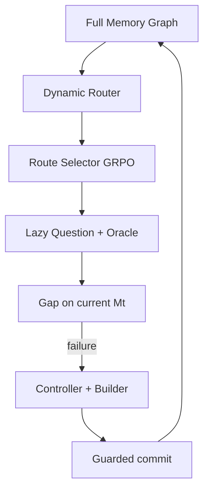

# AdvMem 动态 Graph Route：代码与算法逻辑

本文对应分支 `codex/dynamic-graph-route-loop-v2`。描述以当前代码为准，重点回答：

1. 为什么 Graph 必须始终参与训练；
2. Router、Attacker 和 Question Generator 如何分工；
3. 如何做到“先选 Path，再生成问题”；
4. 冷启动为什么仍然训练 Attacker；
5. Probe Cache 为什么不会重新形成固定信息边界；
6. `success_pool`、`high_priority_buffer` 和 Graph coverage 如何协同。

---

## 1. 从固定 Bank 改为动态 Graph 的原因

设 Graph 全部可用证据为 $E_G$，固定 Bank 覆盖证据为 $E_B$。有限离线采样通常只能
满足：

$$
E_B\subset E_G
$$

如果训练只读取 Bank，Builder 永远无法接触 $E_G-E_B$。增加训练轮数不会改变这个
上界。因此当前实现重新规定：

> Memory Graph 是唯一候选真源；Probe 只是已选 Route 的问题缓存。

Graph 每轮参与 Route proposal，cache 中不存在的 Route 仍可在未来被提出。

---

## 2. Policy 边界

系统只有两个 learned action：

| Policy | 输入 | 输出 | 学习目标 |
|---|---|---|---|
| Route Selector | Route targets、当前 known memory、history | `{"choice":i}` | 去哪里寻找当前缺口 |
| Memory Builder | evidence、确定的 operation/targets | `{"content":"..."}` | 怎样写入紧凑且不遗忘的 memory |

以下组件全部冻结：

- Graph Router：提出结构合法的 Route；
- Question Generator：把已选 Route 转成问题；
- Oracle：验证问题和 supporting sources；
- Gap Evaluator：检索、回答和诊断；
- Repair Controller：确定 ADD/MERGE 与 targets；
- Commit verifier：全量回归后原子提交。

Question Generator 不属于 Attacker policy，因此问题生成质量不会扩大 Selector 的动作
空间。

---

## 3. 在线架构



不存在训练前必须完成的 Bank 构建阶段。`train.sh` 直接接收 `--graph`。

---

## 4. 核心状态

### 4.1 MemoryState

每个 LongMemEval case 有一个独立 `MemoryState`：

```text
version
iteration
nodes
capability_ledger
evidence_ledger
edit_history
success_pool
high_priority_buffer
attack_history
```

它描述 Builder 当前已经构造出的 $M_t$，不保存完整 Graph。

### 4.2 CaseRunState

除 MemoryState 外，每个 case 保存：

```text
node_visit_counts: graph_fact_id → selected_attempts
```

这个计数只在动态 Route 被正式选中尝试后增加。仅仅出现在 proposal 中不会增加持久
计数，否则未被 Attacker 处理的节点可能被误认为已经覆盖。

### 4.3 ProbeCache

`probe_cache.json` 的键是 `route_id`：

```text
route_id → RouteProbe(route, question, oracle, golden_answer)
```

它有三个性质：

1. lazy：只在 policy rollout 或正式攻击选择 Route 后构造；
2. reusable：相同 Route 不重复调用 Question Generator/Oracle；
3. non-authoritative：Router 从 Graph 提候选时不查询 cache 是否包含 Route。

文件使用独立 lock 和原子 replace，Attacker reward 进程与主训练进程可以安全追加。

---

## 5. Graph Router

### 5.1 Graph view

`MemoryGraphView` 只包含：

```text
case_index, user_name, graph_version, nodes, edges
```

LongMemEval benchmark question/answer 不进入 Router，避免训练题泄漏。

### 5.2 四种 Route

| mode | evidence 结构 | 约束 |
|---|---|---|
| `single_fact` | 一个 activated fact | 至少一个 active fact |
| `same_topic` | 同 topic 的2–3个 active facts | topic 至少连接两个 facts |
| `temporal_evolution` | archived → `MERGED_TO` → later active | 新 source 时间更晚且含状态变化语义 |
| `comparison` | 同 topic 的两个 active facts | 共享预定义比较维度 |

比较维度包括 cost、time、quantity、preference、location 和 physical attribute。

### 5.3 Route signature

```python
sha256(user_name, attack_mode, dimension, walk_node_ids)[:20]
```

同一 Router batch 内不重复 signature；跨训练轮允许再次出现。

### 5.4 覆盖锚点

每个 case、每轮的第一条 proposal 锚定最少访问的 eligible evidence：

```python
routes = active_single_routes + valid_temporal_routes
score(route) = (min_evidence_visits, sum_evidence_visits)
coverage_route = random_choice(routes with minimum score)
```

当实际攻击预算尚未被 high-priority replay 占满时，这条 Route 被强制处理。这样
active facts 和可用的 archived→active 历史状态都不完全依赖尚未收敛的 Attacker。

其余 Route 按 mode 循环提出，节点采样权重为：

$$
w_i=\frac{1}{1+visit_i}
$$

---

## 6. 每轮 Route 数据

默认每个 case 动态提出32条 Route。计算 Route 相对当前 memory 的 coverage：

$$
c=\max(c_{node},c_{source})
$$

其中 required IDs 直接来自 Route evidence nodes，而不是尚未生成的 Oracle evidence。

### 6.1 Route novelty

对尚未由 active memory provenance/source 覆盖的 Route evidence nodes：

$$
\tilde N_i=\frac{|E_i^{new}|}
{\sqrt{\max(1,\sum_{e\in E_i^{new}}tokens(e.memory))}}
$$

在当前 case proposal 内归一化：

$$
N_i=\tilde N_i/\max_j\tilde N_j
$$

### 6.2 Pair 构造

- covered 与 uncovered 都存在：循环较短一侧，构造
  `max(len(covered), len(uncovered))` 个 pair；
- 只有一类：按 novelty 排序，最低与最高、次低与次高配对。

空 memory 下32条 Route 约产生16个 records/case。10个 case 约160条记录，90% train
且 batch size=2 时约72个数据 batch/epoch。

---

## 7. Selector observation

对每条 Route，先将 target fact content 拼接成 retrieval query：

```python
query = "\n".join(node.memory for node in route.evidence_nodes)
known = retriever.retrieve(query, M_t, top_k=5)
```

prompt candidate：

```json
{
  "choice": 0,
  "relation": "temporal_evolution",
  "dimension": "travel plan",
  "target": ["planned Kyoto", "changed to Osaka"],
  "known": ["planned Kyoto"],
  "history": {"attempts": 1, "last_gap": "storage_gap"}
}
```

这里没有问题文本。Selector 只能根据 Path 与当前 memory 的关系选位置。

合法输出只有：

```json
{"choice":0}
```

布尔值、越界整数、多字段或非 JSON 输出 reward 为 -1。

---

## 8. 先选 Route，后生成问题

GRPO reward 收到 rollout response 后执行：

```python
choice = strict_parse(response)
route = context.routes[choice]
probe = context.cached_probe(route)
probe = probe or persistent_cache.get(route)
probe = probe or probe_factory.build(route)
```

因此因果顺序严格是：

```text
policy choice → selected route → question generation
```

不是先为所有 Route 固定问题后再让 policy 挑问题措辞。

一个 GRPO group 有8个 rollouts，但候选窗口默认只有2条 Route。`_probe_cache` 会让
相同 choice 的 rollouts 共用一个 Probe；`_gap_cache` 会让它们共用同一个 memory
评估。

---

## 9. ProbeFactory 过滤链

每条被选 Route 最多尝试三次：

1. DeepSeek 生成一个单行、自然、Route-specific question；
2. 规则拒绝空问题、多问题、元信息和 node/source ID 泄漏；
3. Oracle 只用 Route sources 判断 objective、unambiguous、supported、mode match；
4. 问题不能直接包含 Oracle answer；
5. `route_fidelity >= 0.8`；
6. Qwen 用原始 sources 回答，不能是 `INSUFFICIENT_INFORMATION`；
7. Answer Judge 要求 source answer correctness ≥ 0.8；
8. Qwen 无上下文回答，parametric correctness ≥ 0.8 时拒绝。

通过后生成：

```python
question_id = sha256(route_id + "\n" + question)[:20]
```

问题构造失败或外部服务异常不能证明 Route 无价值，因此：

```text
reward_available = 0
advantage contribution = 0
```

---

## 10. Attacker reward

合法 Probe 使用当前 $M_t$ 做真实 retrieval 和 Answer Agent 评估：

$$
R_A=(1-C_t)+\lambda N_t-\mu P_t
$$

默认：

```text
lambda = 0.1
mu = 0.1
```

重复惩罚：

$$
P_t=1-\frac{1}{\sqrt{1+n}}
$$

$n$ 是该 Route 已记录的有效攻击次数。`gap_type` 仍分 storage/retrieval/reasoning，
但只用于日志和 history，不映射成人工 reward 等级。

缓存键：

```text
Probe: route_id
Gap:   (route_id, memory_version)
```

---

## 11. 冷启动行为

$M_0=\varnothing$ 时：

- 大多数 $C_t=0$，failure 项接近1；
- novelty 根据 evidence 数量和长度产生弱排序；
- coverage anchor 保证至少尝试一个低访问 fact；
- Controller 找不到 provenance target，repair 自然为 ADD。

Attacker 不被跳过。早期 reward 差异较弱是环境真实状态，不通过人为 gap 权重制造差异。

当 memory 增长后：

- 一部分 Route 被完整覆盖；
- 一部分只有部分 provenance；
- 一部分已存储但检索不到；
- 一部分 evidence 已取回但 Answer Agent 仍失败。

此时 answer correctness 和 pair coverage 提供更强学习信号。

---

## 12. 正式攻击预算

若 `candidates_per_case=B`：

$$
B_{priority}=\max(1,\lfloor B/2\rfloor),\quad B>0
$$

调度顺序：

```text
1. high_priority replay，最多占一半预算
2. 一条 least-visited coverage route（若仍有预算）
3. Route Selector 补足剩余预算
```

Priority 使用已经缓存并验证的问题；coverage/fresh Route 在被选后才 materialize Probe。
问题构造失败的 Route 不进入 Builder，但它以后仍可由 Graph 再次提出。

---

## 13. Gap 与 repair

Probe 在当前 memory 上评估：

```python
retrieved = retrieve(question, M_t)
structural = support_coverage(probe, active_nodes)
retrieved_cov = support_coverage(probe, retrieved)
answer = AnswerAgent(question, retrieved)
correctness = AnswerJudge(answer, oracle_answer)
```

诊断：

| 条件 | gap |
|---|---|
| structural < 1 | storage |
| structural = 1 且 retrieved < 1 | retrieval |
| evidence 已取回但 answer 错误 | reasoning |
| correctness ≥ 0.8 | none |

若评估服务不可用，问题立即进入 `high_priority_buffer`，不再静默丢回普通 pool。

---

## 14. Repair Controller

Controller 用 Oracle supporting evidence 匹配 active memory 的 node/source provenance：

```python
targets = [
    memory for memory in active_nodes
    if memory.provenance intersects required_provenance
]

operation = MERGE if targets else ADD
```

所有匹配节点一起 MERGE，避免遗留重复或冲突表示。Builder 无权修改 operation 和
target IDs。

---

## 15. Memory Builder

Builder prompt 只暴露：

```text
question
operation
new evidence text/time/role
target memory contents
```

唯一合法输出：

```json
{"content":"The user changed the destination from Kyoto to Osaka."}
```

严格拒绝 operation、targets、解释文字和其他字段。

rollout 在不带可信 provenance 的临时状态评估，避免隐藏标签让 retrieval 虚高。正式
commit 才写入新 evidence provenance，并在 MERGE 时继承 target provenance。

Builder reward：

$$
R_B=C_{after}-C_{before}-R_{regression}-0.05L
$$

grounding false、schema 非法或超过128 tokens 时直接 -1。

---

## 16. Guarded commit

rollout `commit_valid` 不是直接提交。正式流程：

```python
if reward <= 0 or not commit_valid:
    mark_high_priority(current)
    return

trusted_temp = execute(action, trusted_provenance=True)

for old_question in success_pool:
    require(answer_and_support(old_question, trusted_temp))

require(answer_and_support(current_question, trusted_temp))
commit(trusted_temp)
```

任何失败都保留旧 MemoryState。没有半提交。

---

## 17. 两个保障池

### success_pool

只有问题能够正确回答且可归因到非空 memory support 时进入。它定义系统承诺保持的
历史能力，正式 commit 必须全量回归。

### high_priority_buffer

以下情况进入：

- 初次或 repair 重评估 Judge/API 不可用；
- Builder schema、grounding、answer 或 retention 不通过；
- reward 不满足 commit；
- 正式 commit 当前问题或旧 success 回归失败。

同一问题队列唯一；再次失败时移到队尾；成功后从 high-priority 移除并加入 success。

---

## 18. 一轮完整伪代码

```python
for round in rounds:
    for case:
        routes[case] = router.sample_graph(
            count=routes_per_case,
            least_visited_anchor=True,
        )

    attacker_records = pair(routes, current_memory)
    attacker = GRPO(attacker, attacker_records)
    probe_cache.refresh()

    for case:
        priority = high_priority[:half_budget]
        coverage = first_least_visited_route()
        fresh = attacker.select(remaining_routes)

        for route in coverage + fresh:
            record_node_visit(route)
            probe = cache.get(route) or build_probe(route)
            if probe:
                selected.append(probe)

        for probe in priority + selected:
            if evaluation_unavailable:
                mark_high_priority(probe)
            elif already_answered:
                mark_success(probe)
            else:
                pending.append(plan_repair(probe))

    builder = GRPO(builder, pending)

    for repair in pending:
        re_evaluate_on_latest_memory()
        generate_content()
        reward_and_guarded_commit()

    save_run_state()
```

Builder inference 前重新评估 pending，因为同 case 较早的 commit 可能已经修复后续问题
或改变其 MERGE targets。

---

## 19. RunState 与输出

`run_state.json`：

```text
pipeline_version = dynamic_graph_route_loop_v2
graph_version
next_round
attacker_model
builder_model
cases:
  memory
  node_visit_counts
```

恢复时检查：

- pipeline version；
- graph version；
- Graph case index 集合。

输出：

```text
work_dir/
  run_state.json
  probe_cache.json
  services/
  round_000/
    attacker_data/
    attacker/checkpoints/rollouts/reward_trace.jsonl
    attacker/model/
    memory_builder_data/
    memory_builder/model/
```

---

## 20. 日志解释

每 case：

```text
selected   实际得到合法 Probe 并完成评估的数量
replayed   high-priority 强制重放数量
explored   least-visited coverage Route 尝试数量
deferred   服务不可用并进入 high-priority 的数量
defended   无需 edit 已能回答的数量
committed  通过全量回归的 edit 数量
discarded  reward/commit 未通过数量
```

Attacker reward：

```text
informative_groups  可用 rollout 中是否存在 reward 差异
unique_choices      rollout 是否探索了多个 Route choice
unavailable         Probe/Judge 服务不可用数量
```

---

## 21. 关键参数

| 参数 | 作用 | 默认 |
|---|---|---:|
| `routes-per-case` | 每轮动态图 Route proposal 数 | 32 |
| `candidates-per-case` | 实际攻击/修复预算 | 8 |
| `selector-candidates` | 每个 choice prompt 的 Route 数 | 2 |
| `batch-size` | Verl train batch | 2 |
| Attacker rollout n | 每 prompt choice rollouts | 8 |
| Builder rollout n | 每 repair content rollouts | 4 |

`routes-per-case` 决定 Attacker 数据规模，`candidates-per-case` 决定实际 Builder 成本，
两者不应混淆。

---

## 22. 代码文件

| 文件 | 当前职责 |
|---|---|
| `attacker/graph_router.py` | Graph Route 与 coverage anchor |
| `attacker/models.py` | Route、Probe、route-only reward context |
| `attacker/selector.py` | 无 question 的 Route choice prompt |
| `attacker/probe.py` | frozen question + multi-stage validation |
| `attacker/probe_cache.py` | persistent lazy cache |
| `attacker/gap.py` | Route novelty、Probe gap |
| `attacker/reward.py` | choice 后构造 Probe 并计算 reward |
| `training/dataset_builder.py` | 每轮动态图 pair records |
| `training/run_alternating.py` | 完整在线 Graph loop |
| `training/run_state.py` | memory 与 node coverage 恢复 |
| `defender/controller.py` | deterministic ADD/MERGE |
| `defender/memory_builder.py` | content-only action |
| `memory/store.py` | state transition 与保障池 |

旧 `attacker/probe_bank.py` 和 `scripts/build_probe_bank.py` 已删除，避免同时存在两套互相
冲突的信息入口。

---

## 23. 运行方式

```bash
bash train.sh \
  --graph ./data/longmemeval/memory_graph_v4_10.json \
  --graph-version v4 \
  --model /root/autodl-tmp/models/Qwen3-1.7B \
  --work-dir ./data/training_10_v3.0 \
  --rounds 5 \
  --epochs 1 \
  --routes-per-case 32 \
  --candidates-per-case 8 \
  --selector-candidates 2 \
  --batch-size 2
```

第一次必须使用新 work directory。旧 fixed-bank pipeline 的 checkpoint schema 不做隐式
迁移。

---

## 24. 测试覆盖

当前测试覆盖：

- least-visited coverage route；
- Route-only prompt 不包含 `probe_question`；
- reward 只为被选 Route 构造 Probe，并在重复 rollout 复用；
- persistent Probe Cache round trip；
- cold-start novelty；
- covered/uncovered pair；
- repeat penalty 与 gap cache；
- ADD/MERGE、content-only schema、grounding reward；
- `success_pool/high_priority_buffer`；
- RunState graph version、case 集合和 coverage count 恢复。

运行：

```bash
python -m unittest discover -s tests -v
python -m compileall attacker defender memory training scripts tests
```
